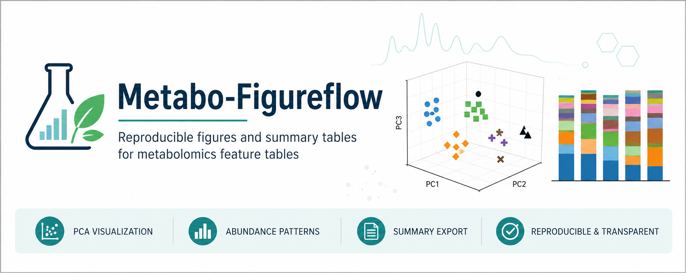

# Metabo-Figureflow

**Metabo-Figureflow** is a lightweight Python workflow for generating reproducible metabolomics figures and summary tables from curated LC-MS feature tables.

This repository was developed for the manuscript:

> **Untargeted metabolomics reveals host responses and metabolites linked to host compatibility in Rafflesiaceae parasitism**  
> Jeanmaire Molina, Rinat Abzalimov, Pride Yin, Adhityo Wicaksono, Marco Bürger, James Hill, Faith Bernier, Jun Wen, Susan Pell

The workflow was designed for a *Rafflesia*–*Tetrastigma* untargeted LC-MS metabolomics dataset, but the scripts may be adapted to similar feature-table-based metabolomics studies. It focuses on **downstream visualization and summary export**, not raw LC-MS preprocessing, peak picking, alignment, blank subtraction, or metabolite annotation.

---

## Purpose

The goal of this repository is to provide transparent, reusable, and inspectable scripts for:

- PCA visualization of LC-MS sample groups
- PCA visualization after grouping samples into broader biological supergroups
- stacked-bar visualization of metabolite abundance patterns
- export of PCA scores, PCA loadings, normalized abundance tables, and figure files
- reproducible figure generation from curated feature tables

This workflow assumes that the input feature tables have already undergone upstream LC-MS processing, blank handling, feature annotation, and curation.

---

## Current status

This repository is an early-stage reproducible figure workflow. The current working scripts generate:

1. a 3D PCA plot using detailed sample-group labels,
2. a 3D PCA plot using broader biological supergroups,
3. a stacked-bar plot of the top 20 compounds after total sum scaling.

All current scripts were manually checked, executed, and validated during development to confirm that they load the expected Excel files and generate the expected figure and table outputs.

---

## Contribution

Metabo-Figureflow is **not intended as a novel metabolomics algorithm or a replacement for established LC-MS metabolomics software**.

Its contribution is practical and reproducibility-oriented:

- it converts manuscript-specific figure generation into transparent Python scripts,
- it documents input file expectations and output files,
- it preserves the exact downstream visualization logic used for the study,
- it provides editable scripts that can be checked, rerun, and modified by reviewers or collaborators,
- it bridges curated LC-MS feature tables to publication-ready PCA and stacked-bar figures.

In other words, Metabo-Figureflow is best understood as a **study-specific downstream figure workflow** for curated metabolomics tables.

---

## Relationship to existing tools

Several established tools and platforms already support metabolomics preprocessing, statistical analysis, visualization, and interpretation. For example:

- **XCMS** supports LC/MS peak detection, nonlinear retention-time alignment, peak matching, and metabolite profiling workflows (Smith et al., 2006).
- **MZmine** provides modular mass-spectrometry data processing, visualization, feature-table generation, and compound annotation workflows (Pluskal et al., 2010; Heuckeroth et al., 2024).
- **MS-DIAL** supports deconvolution, identification, and quantification of small molecules from LC-MS/MS datasets (Tsugawa et al., 2015).
- **MetaboAnalyst** provides web-based statistical, functional, and visualization workflows for metabolomics datasets (Xia et al., 2009; Pang et al., 2024).
- **Workflow4Metabolomics** provides Galaxy-based metabolomics workflows with emphasis on reproducibility, sharing, and workflow publication (Giacomoni et al., 2015; Guitton et al., 2017).

Metabo-Figureflow is complementary to these platforms. It assumes that upstream LC-MS processing and annotation have already been completed elsewhere, and it only handles downstream plotting and summary export from curated feature tables.

---

## Repository structure

A simple working structure is:

```text
Metabo-Figureflow/
├── README.md
├── requirements.txt
├── rafflesia_lcms_feature_table.xlsx
├── rafflesia_lcms_group_average_feature_table.xlsx
├── pca_3d_sample_groups.py
├── pca_3d_supergroups.py
└── stacked_bar_top20_compounds_tss.py
```

A more organized structure can also be used:

```text
Metabo-Figureflow/
├── README.md
├── requirements.txt
├── data/
│   ├── rafflesia_lcms_feature_table.xlsx
│   └── rafflesia_lcms_group_average_feature_table.xlsx
├── scripts/
│   ├── pca_3d_sample_groups.py
│   ├── pca_3d_supergroups.py
│   └── stacked_bar_top20_compounds_tss.py
└── outputs/
```

If using separate `data/` and `scripts/` folders, update the input file paths inside the scripts accordingly.

---

## Input data

### 1. PCA feature table

The PCA scripts expect an Excel file named:

```text
rafflesia_lcms_feature_table.xlsx
```

The workbook should contain a sheet named:

```text
Sheet1
```

Recommended columns include:

```text
RT
m/z
M meas
Ions
MS/MS
Name
Molecular_Formula
Feature_Label
sapbud_1
sapbud_2
Raffbudspec_1
Raffbudlag_1
infectedTHAI_1
infectedCAM_1
infectedILO_1
UNinfectedTHAI_1
UNinfectedCAM_1
UNinfectedILO_1
uninfecraffspec-stemleaf_1
nonhostILO_1
NonhostCAM_1
raffseed_1
Ampelopsis_1
```

The exact sample suffixes may differ, but the sample intensity columns must contain recognizable group-name strings used by the scripts.

Important expectations:

- `Feature_Label` is used as the feature identifier when available.
- Average columns beginning with `ave` are excluded from PCA.
- Blank columns or unmatched columns are ignored by group-mapping logic.
- Intensity values should be numeric or convertible to numeric values.

### 2. Group-average feature table

The stacked-bar script expects an Excel file named:

```text
rafflesia_lcms_group_average_feature_table.xlsx
```

Recommended columns include:

```text
Feature_Label
averaffseed
aveRaffbudspec
aveinfectedILO
aveUNinfectedILO
aveuninfecraffspec-stemleaf
avenonhostILO
```

The script identifies group-average columns by searching for column names that begin with:

```text
ave
```

Negative values are clipped to zero before top-compound selection and total sum scaling.

---

## Installation

Install the required Python packages:

```bash
pip install pandas numpy scikit-learn matplotlib openpyxl
```

Optional `requirements.txt`:

```text
pandas
numpy
scikit-learn
matplotlib
openpyxl
```

---

## Script 1: 3D PCA of detailed sample groups

### Script

```text
pca_3d_sample_groups.py
```

### Description

This script performs PCA on LC-MS feature intensities across detailed sample groups.

The script:

1. loads `rafflesia_lcms_feature_table.xlsx`,
2. reads `Sheet1`,
3. uses `Feature_Label` as the feature identifier when available,
4. removes average columns beginning with `ave`,
5. assigns sample columns to detailed biological groups,
6. transposes the matrix so rows represent samples and columns represent features,
7. converts all intensity values to numeric format,
8. applies autoscaling using mean-centering and unit-variance scaling,
9. performs PCA with three components,
10. generates a 3D PCA plot,
11. exports PCA scores, PCA loadings, PNG, and SVG outputs.

### Run

```bash
python pca_3d_sample_groups.py
```

On Windows, if `python` does not work:

```cmd
py pca_3d_sample_groups.py
```

### Expected outputs

```text
PCA_scores_autoscaled_main-data.csv
PCA_loadings_autoscaled_main-data.csv
PCA_3D_sample_groups.png
PCA_3D_sample_groups.svg
```

---

## Script 2: 3D PCA of biological supergroups

### Script

```text
pca_3d_supergroups.py
```

### Description

This script performs PCA on the same LC-MS feature table but maps detailed sample groups into broader biological supergroups.

Current supergroups include:

```text
BUD
INFECTED
UNINFECTED
UNINFRAFFSPEC
nonhostTET
RAFFSEED
```

Note: in the current supergroup version, `Ampelopsis` is not included unless manually added to the supergroup dictionary.

### Run

```bash
python pca_3d_supergroups.py
```

On Windows:

```cmd
py pca_3d_supergroups.py
```

### Expected outputs

```text
PCA_scores_supergroups.csv
PCA_loadings_supergroups.csv
PCA_3D_supergroups.png
PCA_3D_supergroups.svg
```

---

## Script 3: Top-20 compound stacked-bar plot with total sum scaling

### Script

```text
stacked_bar_top20_compounds_tss.py
```

### Description

This script generates a stacked-bar plot showing the top 20 compounds across group-average columns.

The script:

1. loads `rafflesia_lcms_group_average_feature_table.xlsx`,
2. keeps `Feature_Label` and average columns beginning with `ave`,
3. replaces negative values with zero,
4. extracts compound names from `Feature_Label`,
5. collapses duplicate compound names by averaging intensities,
6. selects the top 20 compounds by total abundance across groups,
7. applies total sum scaling so each group column sums to 1,
8. generates a stacked-bar plot,
9. wraps long legend labels,
10. tilts x-axis labels for readability,
11. exports raw means, normalized values, PNG, and SVG outputs.

### Run

```bash
python stacked_bar_top20_compounds_tss.py
```

On Windows:

```cmd
py stacked_bar_top20_compounds_tss.py
```

### Expected outputs

```text
top20_compounds_stacked_TSS.png
top20_compounds_stacked_TSS.svg
top20_compounds_raw_means.csv
top20_compounds_TSS.csv
```

---

## AI assistance declaration

Generative AI tools were used as coding assistants to help draft, refine, troubleshoot, and document Python scripts for figure generation and downstream summary export.

All scripts were reviewed, edited, executed, and validated by human users during development. The generated figures and exported files were checked for successful execution and consistency with the intended data structure. Biological interpretation, manuscript conclusions, and responsibility for the final analyses remain with the authors.

---

## FAQ and troubleshooting

### 1. The script says `FileNotFoundError`. What happened?

The Excel file is probably not in the same folder as the Python script, or the filename does not match exactly.

Check that the file is named:

```text
rafflesia_lcms_feature_table.xlsx
```

or, for the stacked-bar script:

```text
rafflesia_lcms_group_average_feature_table.xlsx
```

On Linux and macOS, filenames are case-sensitive.

---

### 2. The script says `Worksheet named 'Sheet1' not found`.

The Excel workbook may have a different sheet name.

Either rename the sheet in Excel to:

```text
Sheet1
```

or edit the script:

```python
df = pd.read_excel(file_path, sheet_name="YourSheetName")
```

---

### 3. The PCA plot is missing a group.

Check whether the sample column names contain the expected group strings. For example:

```text
infectedTHAI
infectedCAM
infectedILO
UNinfectedTHAI
UNinfectedCAM
UNinfectedILO
```

If the group names are misspelled, capitalized differently in unexpected ways, or separated by unusual symbols, the script may classify them as `Unknown` and remove them from the plot.

---

### 4. Why did `UNinfected` samples disappear or merge with `INFECTED`?

This can happen if substring matching checks `infected` before `UNinfected`, because `UNinfected` contains the word `infected`.

The supergroup dictionary should check `UNINFECTED` before `INFECTED`, or the group-matching function should explicitly prioritize `UNinfected` names.

---

### 5. Why is `Ampelopsis` missing in the supergroup PCA?

The current supergroup PCA script does not include `Ampelopsis` by default. This was inherited from the intended figure grouping.

To include it, add a new entry to the supergroup dictionary, for example:

```python
"AMPELOPSIS": ["Ampelopsis"],
```

and add `"AMPELOPSIS"` to the plotting order.

---

### 6. The Matplotlib figure does not pop up, but output files are generated.

This is usually a display-backend issue, especially in WSL, remote terminals, or headless environments.

The scripts save PNG and SVG files before displaying the interactive figure window, so the figure files should still be available even if the window does not open correctly.

To open the output folder from WSL:

```bash
explorer.exe .
```

---

### 7. The stacked-bar legend is too long or unreadable.

Long compound names can stretch the legend. The current stacked-bar script wraps long legend entries. If the legend is still too wide, reduce the wrapping width or increase the figure width inside the script.

---

### 8. The x-axis labels are overlapping.

Tilt the x-axis labels in the plotting section:

```python
ax.set_xticklabels(ax.get_xticklabels(), rotation=45, ha="right")
```

You can use `rotation=60` or `rotation=90` for longer labels.

---

### 9. The stacked-bar script says `Feature_Label` is missing.

The group-average table must contain a column named exactly:

```text
Feature_Label
```

Recommended minimum header:

```text
Feature_Label | averaffseed | aveRaffbudspec | aveinfectedILO | aveUNinfectedILO | aveuninfecraffspec-stemleaf | avenonhostILO
```

---

### 10. The PCA loadings file has confusing identifiers.

Make sure the input file contains a `Feature_Label` column. If `Feature_Label` is absent, the script falls back to the first column, which may be `RT` or another metadata field.

---

### 11. Can this workflow process raw LC-MS files?

No. This workflow does not process raw LC-MS data. It expects curated feature tables that have already been processed and annotated using other tools or platforms.

---

### 12. Can I use this workflow for another metabolomics dataset?

Yes, but the column names and group-mapping dictionaries must be edited to match your dataset.

---

## Contact

For questions about the manuscript dataset, interpretation, or troubleshooting, please contact:

- Jeanmaire Molina — `jmolina2@pace.edu`
- Adhityo Wicaksono — `adhityo.wicaksono@gmail.com`

---

## References

Antonelli, J., Claggett, B. L., Henglin, M., Watrous, J. D., Lehmann, K. A., Hushcha, P., Demler, O., Mora, S., Niiranen, T., Pereira, A. C., Jain, M., & Cheng, S. (2019). Statistical workflow for feature selection in human metabolomics data. *Metabolites, 9*(7), 143. https://doi.org/10.3390/metabo9070143

Guitton, Y., Tremblay-Franco, M., Le Corguillé, G., Martin, J.-F., Pétéra, M., Roger-Mele, P., Delabrière, A., Goulitquer, S., Monsoor, M., Duperier, C., Canlet, C., Servien, R., Tardivel, P., Caron, C., Giacomoni, F., & Thévenot, E. A. (2017). Create, run, share, publish, and reference your LC-MS, FIA-MS, GC-MS, and NMR data analysis workflows with the Workflow4Metabolomics 3.0 Galaxy online infrastructure for metabolomics. *International Journal of Biochemistry & Cell Biology, 93*, 89–101. https://doi.org/10.1016/j.biocel.2017.07.002

Heuckeroth, S., Damiani, T., Smirnov, A., Mokshyna, O., Brungs, C., Korf, A., Smith, J. D., Stincone, P., Dreolin, N., Nothias, L.-F., Hyötyläinen, T., Orešič, M., Karst, U., Dorrestein, P. C., Petras, D., Du, X., van der Hooft, J. J. J., Schmid, R., & Pluskal, T. (2024). Reproducible mass spectrometry data processing and compound annotation in MZmine 3. *Nature Protocols, 19*, 2597–2641. https://doi.org/10.1038/s41596-024-00996-y

Hunter, J. D. (2007). Matplotlib: A 2D graphics environment. *Computing in Science & Engineering, 9*(3), 90–95. https://doi.org/10.1109/MCSE.2007.55

Pang, Z., Chong, J., Zhou, G., de Lima Morais, D. A., Chang, L., Barrette, M., Gauthier, C., Jacques, P.-É., Li, S., & Xia, J. (2021). MetaboAnalyst 5.0: narrowing the gap between raw spectra and functional insights. *Nucleic Acids Research, 49*(W1), W388–W396. https://doi.org/10.1093/nar/gkab382

Pedregosa, F., Varoquaux, G., Gramfort, A., Michel, V., Thirion, B., Grisel, O., Blondel, M., Prettenhofer, P., Weiss, R., Dubourg, V., Vanderplas, J., Passos, A., Cournapeau, D., Brucher, M., Perrot, M., & Duchesnay, É. (2011). Scikit-learn: Machine learning in Python. *Journal of Machine Learning Research, 12*, 2825–2830.

Pluskal, T., Castillo, S., Villar-Briones, A., & Orešič, M. (2010). MZmine 2: Modular framework for processing, visualizing, and analyzing mass spectrometry-based molecular profile data. *BMC Bioinformatics, 11*, 395. https://doi.org/10.1186/1471-2105-11-395

Smith, C. A., Want, E. J., O'Maille, G., Abagyan, R., & Siuzdak, G. (2006). XCMS: Processing mass spectrometry data for metabolite profiling using nonlinear peak alignment, matching, and identification. *Analytical Chemistry, 78*(3), 779–787. https://doi.org/10.1021/ac051437y

Tsugawa, H., Cajka, T., Kind, T., Ma, Y., Higgins, B., Ikeda, K., Kanazawa, M., VanderGheynst, J., Fiehn, O., & Arita, M. (2015). MS-DIAL: data-independent MS/MS deconvolution for comprehensive metabolome analysis. *Nature Methods, 12*, 523–526. https://doi.org/10.1038/nmeth.3393

Xia, J., Psychogios, N., Young, N., & Wishart, D. S. (2009). MetaboAnalyst: A web server for metabolomic data analysis and interpretation. *Nucleic Acids Research, 37*(Web Server issue), W652–W660. https://doi.org/10.1093/nar/gkp356
